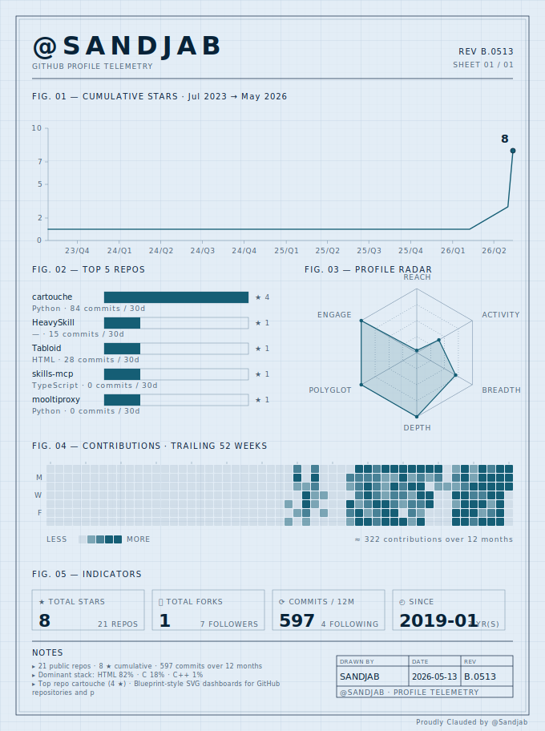

# Sandjab

<picture>
  <source media="(prefers-color-scheme: dark)" srcset="assets/profile-dark.svg">
  
</picture>

The dashboard above is rendered twice a day by [Cartouche](https://github.com/Sandjab/cartouche)
— a small zero-dependency Python lib I wrote for technical-drawing SVG dashboards —
and committed back to this repo by GitHub Actions.

## Reach me

- ✉️ `consulting@gavini.org`
